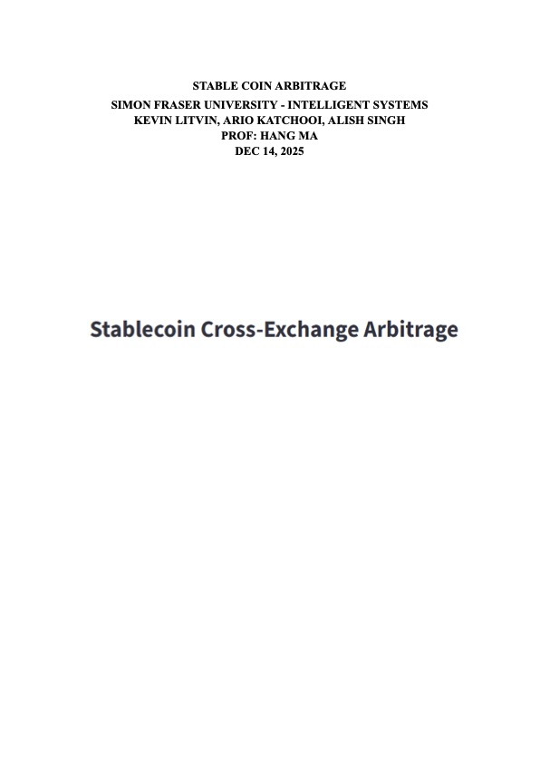
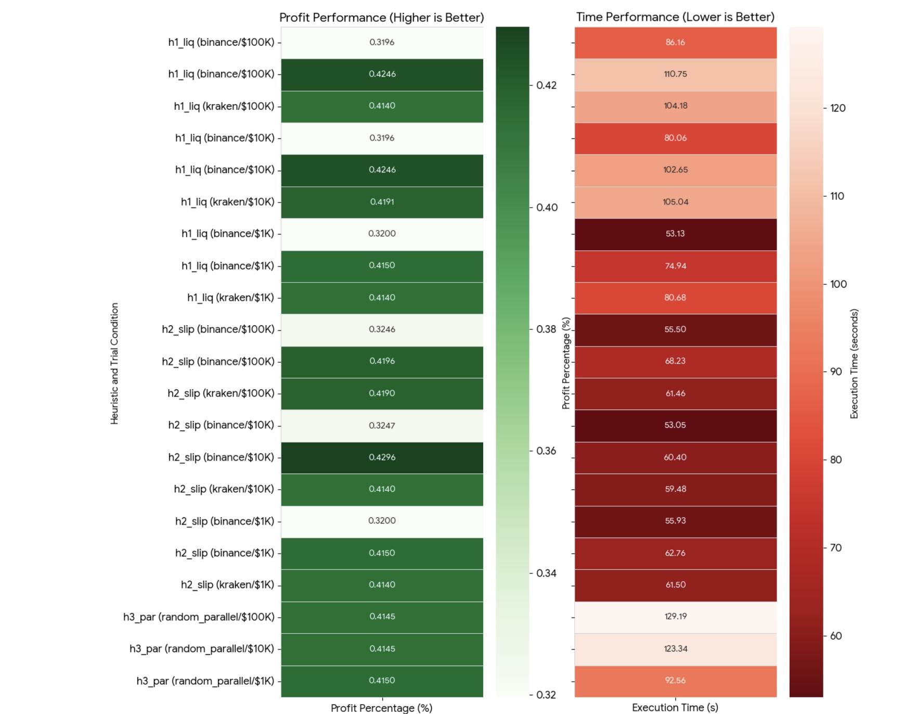

# Stablecoin Cross-Exchange Arbitrage

> An intelligent A* search system for discovering profitable arbitrage opportunities across multiple cryptocurrency exchanges using advanced heuristic functions.

[](https://www.python.org/)
[](https://streamlit.io/)
[](LICENSE)

## Demo Video

[](https://www.youtube.com/watch?v=Fuu5OI83uMY)

**Watch on YouTube**: [https://www.youtube.com/watch?v=Fuu5OI83uMY](https://www.youtube.com/watch?v=Fuu5OI83uMY)

---

## Research

[](StableCoinArbitrage-ResearchReport.pdf)

[**Download Research Report**](StableCoinArbitrage-ResearchReport.pdf) (PDF, 1.2 MB)

The comprehensive research report covers the theoretical foundations, implementation details, experimental methodology, and analysis of the stablecoin cross-exchange arbitrage system.

---

## Table of Contents

- [Demo Video](#demo-video)
- [Research](#research)
- [Overview](#overview)
- [Features](#features)
- [Heuristics](#heuristics)
- [Installation](#installation)
- [Quick Start](#quick-start)
- [Key Results](#key-results)

---

## Overview

This project implements a sophisticated arbitrage detection system that:

- **Fetches live market data** from multiple exchanges (Binance, Kraken, KuCoin, Bybit, Coinbase)
- **Builds a weighted graph** representing exchange wallets and trading/transfer opportunities
- **Uses A* search algorithms** with multiple heuristic functions to find optimal arbitrage paths
- **Provides real-time visualization** through an interactive Streamlit UI
- **Compares heuristic performance** through comprehensive testing and Monte Carlo simulations

The system identifies profitable routes by considering:
- Trading fees and slippage
- Withdrawal fees and transfer times
- Market liquidity and order book depth
- Blockchain congestion and exchange reliability
- Multiple starting positions and parallel exploration

---

## Features

### Core Capabilities
- **Multi-Exchange Support**: Binance, Kraken, KuCoin, Bybit, Coinbase
- **Multiple Stablecoins**: USDT, USDC, DAI, BUSD, TUSD, FDUSD, PYUSD, USDP
- **Advanced Search Algorithms**: A* with multiple heuristic functions
- **Real-Time Data**: Live prices, order books, and 24h volume
- **Interactive UI**: Streamlit-based visualization with real-time logging
- **Performance Analysis**: Comprehensive testing framework and result logging

### Heuristic Functions
- **h1_liquidity**: Volume-based heuristic prioritizing high-liquidity markets
- **h2_slippage**: Order-book slippage-based heuristic minimizing price impact
- **h3_parallel**: Parallel A* searches from random starting points
- **h4_chaincongestion_exchange_risk**: Weighted A* considering blockchain and exchange risks

---

## Heuristics



### h1_liquidity
**Volume-based heuristic** that prefers routes with high trading volume and good liquidity.

- Uses 24-hour trading volume to estimate market depth
- Accounts for order size relative to typical trading volume
- Time-aware (considers remaining arbitrage window)
- **Best for**: Conservative strategies prioritizing reliable execution

### h2_slippage
**Order-book slippage-based heuristic** that penalizes routes where large orders would move prices significantly.

- Walks the order book to estimate actual slippage
- Considers real market depth at current prices
- More accurate for large orders
- **Best for**: Large capital deployments where slippage matters

### h3_parallel
**Meta-heuristic** that runs multiple A* searches in parallel from random starting nodes.

- Explores diverse starting positions simultaneously
- Finds optimal paths from multiple perspectives
- Thread-safe parallel execution
- **Best for**: Discovering opportunities when optimal starting point is unknown

### h4_chaincongestion_exchange_risk
**Weighted A* heuristic** that penalizes fast/risky blockchains and less reliable exchanges.

- Considers blockchain congestion and transfer times
- Accounts for exchange reliability and operational risk
- Fastest execution time (10-20x faster than others)
- **Best for**: Production use requiring speed and risk awareness

**Detailed comparison**: See [HEURISTIC_COMPARISON.md](docs/HEURISTIC_COMPARISON.md)

---

## Installation

### Prerequisites
- Python 3.12 or higher
- pip package manager

### Setup

1. **Clone the repository**
   ```bash
   git clone <repository-url>
   cd Stablecoin-CrossExchange-Arbitrage
   ```

2. **Create virtual environment** (recommended)
   ```bash
   # Windows
   python -m venv venv312
   venv312\Scripts\activate

   # macOS/Linux
   python3 -m venv venv312
   source venv312/bin/activate
   ```

3. **Install dependencies**
   ```bash
   pip install -r requirements.txt
   ```

---

## Quick Start

### Run the Streamlit UI

```bash
streamlit run scripts/ui.py
```

The UI will open in your browser at `http://localhost:8501`

**Note**: The UI takes about 1 minute to load initially as it fetches live market data from all exchanges.

### Run Experiments

```bash
# Monte Carlo simulation (10 trials per heuristic)
python experiments/monte_carlo_simulation.py

# Live heuristic comparison
python experiments/compare_heuristics_live.py

# Unit tests
python experiments/run_h1_unit_tests.py
python experiments/run_h2_unit_tests.py
python experiments/run_h3_unit_tests.py
python experiments/run_h4_unit_tests.py
```

---

## Key Results

### Performance Metrics

Based on comprehensive testing across multiple order sizes ($1K, $10K, $100K):

| Heuristic | Avg Execution Time | Success Rate | Avg Profit* | Efficiency ($/sec) |
|-----------|-------------------|--------------|-------------|---------------------|
| **h4** | **4.7s** | 80% | $180.33 | **$38.45** |
| h1 | 81.8s | 100% | $110.14 | $1.35 |
| h2 | 66.3s | 80% | $91.67 | $1.38 |
| h3 | 104.5s | 100% | $203.49 | $1.95 |

*Average profit from Monte Carlo simulation (10 trials, varied start nodes)

### Key Findings

1. **Speed Advantage**: h4 is **10-20x faster** than other heuristics while maintaining competitive profit
2. **Reliability**: h1 and h3 achieve **100% success rate**; h2 and h4 have 80% (failures with TUSD markets)
3. **Profit Scaling**: Profit percentage remains constant (~0.42%) across order sizes, suggesting linear scaling
4. **Path Efficiency**: h2/h4 find shorter paths (2-4 hops) compared to h1 (3-6 hops)
5. **Start Node Sensitivity**: binance:USDT consistently outperforms binance:BUSD by 20-25%

**Detailed analysis**: See [HEURISTIC_DATA_PATTERNS.md](docs/HEURISTIC_DATA_PATTERNS.md)
